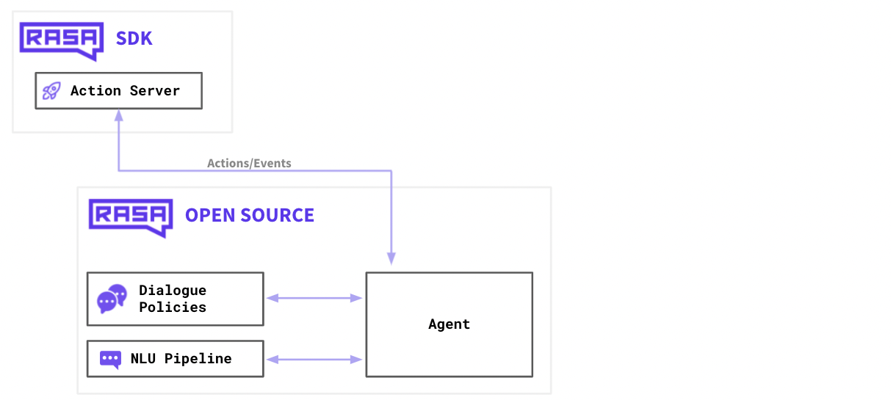
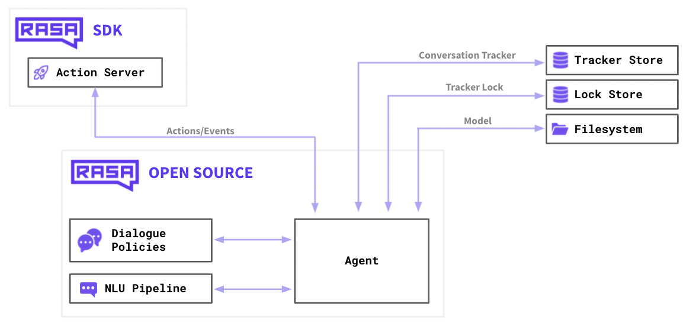
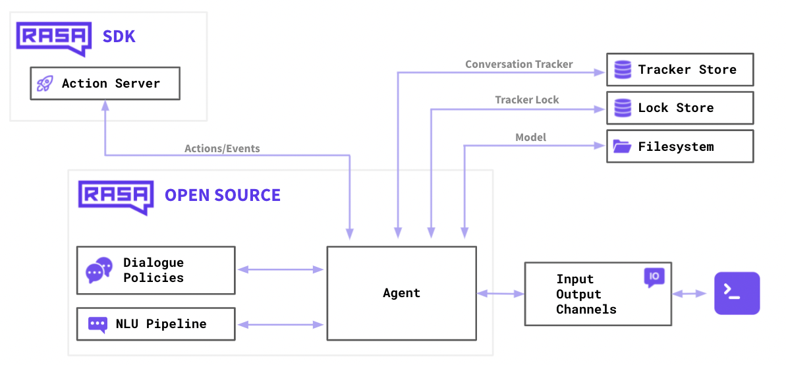
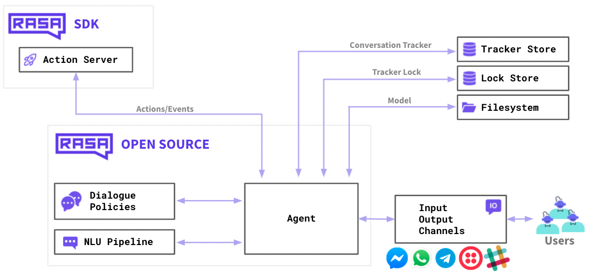

# Rasa Interface Tutorial

This repository contains tutorials on connecting `Rasa` to various user interfaces and some examples of UIs. Note that all the demos here are built and tested with Rasa 3.

We assume you have `Rasa 3` installed and is able to run [Lab1](https://github.com/Dingdong-LIU/Lab1_Chatbot_Rasa). This tutorial will try to connect `Rasa` to some UI samples.

This project is built upon the following resources:
1. https://github.com/scalableminds/chatroom which provide a great Chatroom UI.
2. https://github.com/RasaHQ/rasa-voice-interface who provided a voice interface.
3. [Mozilla Deepspeech](https://github.com/mozilla/DeepSpeech/tree/r0.9) and [Coqua.ai's TTS](https://github.com/coqui-ai/TTS).
4. Rasa [learning center](https://learning.rasa.com). 

## Rasa's Architecture

In the previous Lab, we talked about two seperate services:

1. `Action server` that handles the custom actions.
2. `Dialogue policies` and `NLU pipelines` that handles the machine learning pipelines and the conversational events.

To put this into real world usage, we need to attach more services:

1. `Tracker Store` that can store all the conversations. When you're working on a local machine this may fit in memory, but in production you may have thousands of users and will likely use a database for this.
2. `Lock Store`. Rasa uses a ticket lock mechanism to ensure that incoming messages for a given conversation ID are processed in the right order, and locks conversations while messages are actively processed. This means *multiple Rasa servers can be run in parallel as replicated services*, and clients do not necessarily need to address the same node when sending messages for a given conversation ID.
3. `Filesystem` where you can store your training data as well as your trained models. This can be the disk on your local machine but it may also refer to disk space on a cloud resource.

There's one extra thing that's missing in this diagram though, and that's how our users are going to connect to our assistant.

So far, we've only been interacting with Rasa via the terminal. When you launch `rasa shell` you'll start a small server on your machine and your terminal will communicate with Rasa over HTTP under the hood. Being able to communicate over HTTP is great because it means that we can connect a website to it as well, but it's good to understand that this is but one of the many channels that Rasa supports.

We can connect our chatbot to other input/output channels by configuring `credientials.yml` file. That way, you can configure Rasa to communicate over slack, facebook messenger, whatsapp or any other supported channel.

> We will also use customized connectors to create voice agents

## Tutorial Content

We will introduce 3 UIs via different channel:
1. Connect to **Chatroom** via default **REST** channel.
2. Connect as **a website widget** via default **Socket** channel.
3. Create a **Voice agent** using customized **Socket** channel

For this tutorial, we will use the `02-forms-pizza-ordering-chatbot` from `Lab1` as the example chatbot.