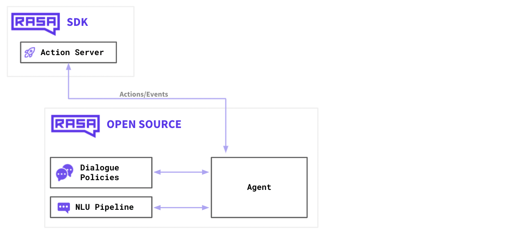
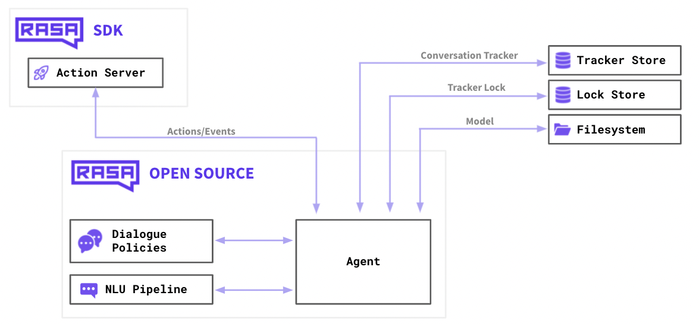

# Rasa Interface Tutorial

This repository contains tutorials on connecting `Rasa` to various user interfaces and some examples of UIs. Note that all the demos here are built and tested with Rasa 3.

We assume you have `Rasa 3` installed and can run [Lab1](https://github.com/Dingdong-LIU/Lab1_Chatbot_Rasa). This tutorial will try to connect `Rasa` to some UI samples.

This project is built upon the following resources:
1. https://github.com/scalableminds/chatroom which provides a great Chatroom UI.
2. https://github.com/RasaHQ/rasa-voice-interface which provided a voice interface.
3. [Mozilla Deepspeech](https://github.com/mozilla/DeepSpeech/tree/r0.9) and [Coqua.ai's TTS](https://github.com/coqui-ai/TTS).
4. Rasa [learning center](https://learning.rasa.com).
5. Some blogs that provided me with [code example](https://rasa.com/blog/how-to-build-a-voice-assistant-with-open-source-rasa-and-mozilla-tools/) and [debug hints](https://dustyposa.github.io/posts/d7e97916/)

## Table of Content

- [Rasa Interface Tutorial](#rasa-interface-tutorial)
  - [Table of Content](#table-of-content)
  - [Rasa's Architecture](#rasas-architecture)
  - [Tutorial Content](#tutorial-content)
  - [Install Dependencies](#install-dependencies)
    - [Install Node.js \& npm](#install-nodejs--npm)
    - [Install yarn](#install-yarn)
  - [Run Tutorial](#run-tutorial)
    - [Chatroom-source](#chatroom-source)
    - [widget](#widget)
    - [rasa-voice-agent](#rasa-voice-agent)
  - [Known Issue](#known-issue)


## Rasa's Architecture

In the previous Lab, we talked about two separate services:

1. `Action server` that handles the custom actions.
2. `Dialogue policies` and `NLU pipelines` that handle the machine learning pipelines and the conversational events.

To put this into real-world usage, we need to attach more services:

1. `Tracker Store` that can store all the conversations. When you're working on a local machine this may fit in memory, but in production, you may have thousands of users and will likely use a database for this.
2. `Lock Store`. Rasa uses a ticket lock mechanism to ensure that incoming messages for a given conversation ID are processed in the right order and locks conversations while messages are actively processed. This means *multiple Rasa servers can be run in parallel as replicated services*, and clients do not necessarily need to address the same node when sending messages for a given conversation ID.
3. `Filesystem` where you can store your training data as well as your trained models. This can be the disk on your local machine but it may also refer to disk space on a cloud resource.

There's one extra thing that's missing in this diagram though, and that's how our users are going to connect to our assistant.

So far, we've only been interacting with Rasa via the terminal. When you launch `rasa shell` you'll start a small server on your machine and your terminal will communicate with Rasa over HTTP under the hood. Being able to communicate over HTTP is great because it means that we can connect a website to it as well, but it's good to understand that this is one of the many channels that Rasa supports.


We can connect our chatbot to other input/output channels by configuring `credientials.yml` file. That way, you can configure Rasa to communicate over slack, Facebook messenger, WhatsApp or any other supported channel.

> We will also use customized connectors to create voice agents

## Tutorial Content

We will introduce 3 UIs via different channels:
1. Connect to **Chatroom** via default **REST** channel.
2. Connect as **a website widget** via the default **Socket** channel.
3. Create a **Voice agent** using a customized **Socket** channel

For this tutorial, we will use the `02-forms-pizza-ordering-chatbot` from `Lab1` as the example chatbot.

## Install Dependencies

You will need `node.js` and `yarn` to run the tutorial. 

> Note: You have to use `node@14` to run `UI/rasa-voice-interface`. 

For Mac users, you can refer to the posts here:

### Install Node.js & npm
1. If you are using `Apple Silicon Mac`, you can follow the guide here: https://devzilla.io/using-nodejs-14-with-mac-silicon-m1
2. If you are using `Intel Mac` or Unix-like OS, things are much simpler. 
   1. Install `nvm` - please follow the official guide [here](https://github.com/nvm-sh/nvm#install--update-script). 
   2. And use `nvm` to install `node.js` following [examples on GitHub](https://github.com/nvm-sh/nvm#install--update-script). We recommend installing version 14 via `nvm install 14`.
3. If you are using a windows computer, you can download it from here: https://nodejs.org/en/blog/release/v14.17.3

### Install yarn

```
npm install --global yarn
```

## Run Tutorial

You can refer to `README.md` files in each UI example for more detailed explanations. Here's a summary.

I recommend first running `chatroom-source`, then trying `widget`, and finally, playing with `rasa-voice-interface`.

### Chatroom-source
1. Modify `chatbot/02-forms-pizza-ordering-chatbot/credentials.yml` to enable `REST` API, i.e.,
```yml
rest:

```

2. **Run Rasa chatbot**. Launch action server and rasa server in 2 separate terminals:
```bash
# Change directory to `chatbot/02-forms-pizza-ordering-chatbot first`
# You need to run `rasa train` first if you haven't train the rasa model
rasa train
# In the first terminal window 
rasa run actions
# In the second terminal window
rasa run --enable-api -p 5005 --debug --cors "*"
```

3. **Start the UI**. Launch UI from the third terminal window 

You can start the UI directly by:
```bash
python -m http.server 8889
```
And then open `http://localhost:8889`
> Note: You may come into `block by CORS policy error` when you are using newer version of `Google Chrome`. You can refer to this post to temporarily disable `Block insecure private network requests`: https://stackoverflow.com/questions/69542810/has-been-blocked-by-cors-policy-the-request-client-is-not-a-secure-context-and

If you like to compile it yourself / do further development, you can run the following commands:
```bash
# Change directory to `UI/chatroom-source`
# Skip this line if you already installed dependance for yarn
yarn install 
# Then Run
yarn serve
```
And open the website as displayed in the terminal window.

### widget
1. Modify `chatbot/02-forms-pizza-ordering-chatbot/credentials.yml` to enable `socketio` API, i.e.,
```yml
socketio:
 user_message_evt: user_uttered
 bot_message_evt: bot_uttered
 session_persistence: false
```

2. **Run Rasa chatbot**. Launch action server and rasa server in 2 separate terminals:
```bash
# Change directory to `chatbot/02-forms-pizza-ordering-chatbot first`
# In the first terminal window 
rasa run actions
# In the second terminal window
rasa run --enable-api -p 5005 --debug --cors "*"
``` 

3. **Start the UI**. Launch UI from another terminal window.
```bash
# Change directory to `UI/widget`
python -m http.server 8888
```
Open the webpage `http://localhost:8888`

> Note: You may come into `block by CORS policy` error when you are using newer version of `Google Chrome`. You can refer to this post to temporarily disable `Block insecure private network requests`: https://stackoverflow.com/questions/69542810/has-been-blocked-by-cors-policy-the-request-client-is-not-a-secure-context-and

### rasa-voice-agent

1. Add custom socket connectors, and utilities to run Text-to-speech and Auto-Speech-Recognision into your chatbot.
> The files are already been added in `components` and `utils`
2. Download the models
   1. First, install `deepspeech` and download the model from [Deepspeech's release page](https://github.com/mozilla/DeepSpeech/releases/tag/v0.9.3)
    ```bash
    # Install DeepSpeech
    pip3 install deepspeech
    
    # Create a folder under `chatbot/02-forms-pizza-ordering-chatbot`
    cd chatbot/02-forms-pizza-ordering-chatbot
    mkdir stt_model
    cd stt_model
    # Download pre-trained English model files
    curl -LO https://github.com/mozilla/DeepSpeech/releases/download/v0.9.3/deepspeech-0.9.3-models.pbmm
    curl -LO https://github.com/mozilla/DeepSpeech/releases/download/v0.9.3/deepspeech-0.9.3-models.scorer
    ```
   2. Then install `Coqui's TTS` package. The model will automatically be downloaded when you run the code for the first time.
    ```bash
    pip3 install TTS
    ```
    
3. Modify `chatbot/02-forms-pizza-ordering-chatbot/credentials.yml` to enable `socketio` API, i.e.,
```yml
utils.voice_connector.VoiceInput:
  user_message_evt: user_uttered
  bot_message_evt: bot_uttered
  session_persistence: false
```
4. **Run Rasa chatbot**. Launch action server and rasa server in 2 separate terminals:
```bash
# Change directory to `chatbot/02-forms-pizza-ordering-chatbot` first
# In the first terminal window 
rasa run actions
# In the second terminal window
rasa run --enable-api -p 5005 --debug --cors "*"
```
5. **Launch a file server**. Launch a file server from another terminal window.
```bash
# Change directory to `UI/widget`
python -m http.server 8888
```
6. **Launch the UI**. Launch the VUE app:
```bash
# Change directory to `UI/rasa-voice-interface` first
# Make sure you are using node@14. 
# If you are using nvm, run `nvm use 14`
# Skip this line if you already installed dependance for Vue
npm install
# When it finishes
npm run serve
```

## Known Issue
1. The 3rd UI, `rasa-voice-interface`, is not fully workable with `Apple Silicon Mac`. The UI operates well, but the `deepspeech` and `TTS` module is not compatible with `M1 chips`. You may replace these 2 modules to make a voice agent.
