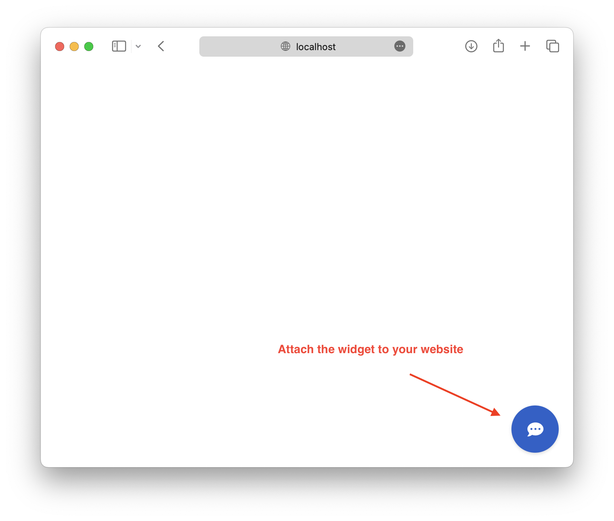

# Web-widget UI

## Table of content
- [Web-widget UI](#web-widget-ui)
  - [Table of content](#table-of-content)
  - [Example](#example)
  - [Setup Socket IO Channel](#setup-socket-io-channel)
  - [Chat Widget](#chat-widget)
  - [Run Tutorial](#run-tutorial)

## Example


## Setup Socket IO Channel

The SocketIO channel uses websockets and is real-time. To use the SocketIO channel, add the credentials to your `credentials.yml`:

```yml
socketio:
  user_message_evt: user_uttered
  bot_message_evt: bot_uttered
  session_persistence: true/false
```
The first two configuration values define the event names used by Rasa when sending or receiving messages over socket.io.

Restart your Rasa server to make the new channel endpoint available to receive messages. You can then send messages to `http://<host>:<port>/socket.io`, replacing the host and port with the appropriate values from your running Rasa server.

## Chat Widget
Once you've set up your SocketIO channel, you can use the official Rasa Chat Widget on any webpage. Just paste the following into your site HTML and paste the URL of your Rasa instance into the data-websocket-url attribute
```html
<div id="rasa-chat-widget" data-websocket-url="https://your-rasa-url-here/"></div>
<script src="https://unpkg.com/@rasahq/rasa-chat" type="application/javascript"></script>
```
For more information, including how to fully customize the widget for your website, you can check out the full documentation.
Alternatively, if you want to embed the widget in a React app, there is a library in the NPM package repository.

## Run Tutorial
Go to `widget` directory, and run the following command.
```bash
python -m http.server 8888
```
Open `http://localhost:8888` in your browser, and you will see a chatbot icon on the buttom right.