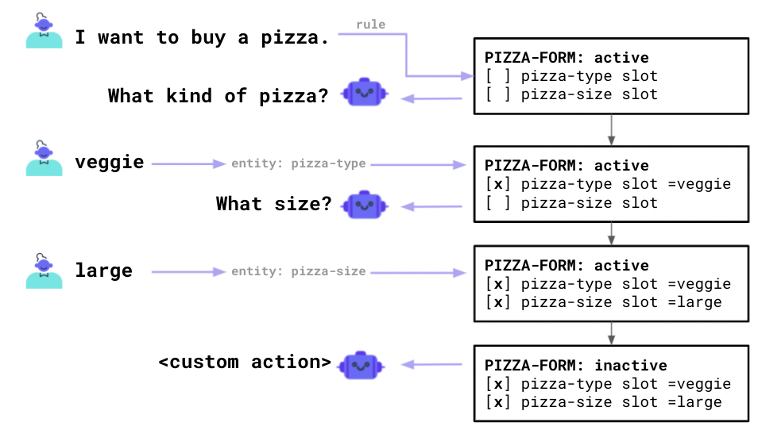
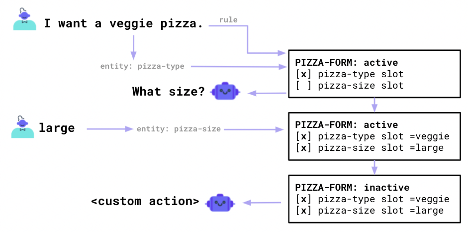
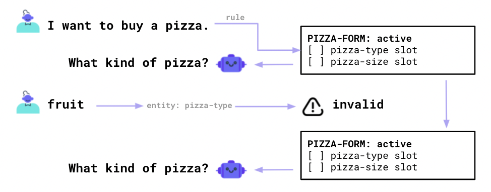

# Pizza Ordering Chatbot
## Acknowledgment
This tutorial is adapted from 
* Rasa Learning Center's course on [Basic Forms](https://learning.rasa.com/conversational-ai-with-rasa/basic-forms/).
* Their Github Repo [here](https://github.com/RasaHQ/conversationl-ai-course-3.x/tree/main/video-09-1-basic-forms).

## Appendix

There are many use cases to collect information from a user before taking an action on their behalf. If we'd like to, for example, order a pizza then we'd need to know the kind and the size of the pizza. To make the collection of information easy, Rasa has "Forms" - a feature that we dive into in this segment.

## How does a Rasa-Form work?


Conceptually, a form can be seen as a loop that keeps on asking the user for information until enough slot values have been filled. An example of such a flow is shown in the diagram below.



The idea behind a Rasa form is that we don't need to ask a question if the user has already given us the required information. If the user tells us they want to buy a "veggie pizza", then we don't need to ask about the kind of pizza they're interested in anymore.



## Steps

To set up a basic form, you'll need to change 
1. your `domain.yml` file to configure the form and slots 
2. update your `rules.yml` file so that Rasa understands when you trigger a form loop.

### Example `domain.yml`

The example below demonstrates how to set up a simple form with two slots to fill.

```yml
# This is the form definition.
# Note that we refer to slots defined below.forms:  
forms:
  simple_pizza_form:
    required_slots:
      - pizza_size
      - pizza_type
# These are slot definitions.
# Note that we also have entities with the same name.
slots:
  pizza_size:
    type: text
    influence_conversation: true
    mappings:
    - type: from_entity
      entity: pizza_size
  pizza_type:
    type: text
    influence_conversation: true
    mappings:
    - type: from_entity
      entity: pizza_type
# These are simple entity definitions
entities:
- pizza_size
- pizza_type
# We also need to add relevant intents 
intents:
- buy_pizza
- inform
# We also need to add responses for our form.
responses:  
  utter_submit:  
  - text: I will now order a pizza for you!  
  utter_pizza_slots:  
  - text: I will order a {pizza_size} {pizza_type} pizza.  
  utter_ask_pizza_size:  
  - text: What size would you like your pizza to be?  
  utter_ask_pizza_type:  
  - text: What kind of pizza would you like to buy?
```

You may notice that there are a few responses that follow the `utter_ask_<slot_name>` naming convention. These responses are picked up by our form whenever we'd like the user to give us the information required to fill in a slot name.

### Example `rules.yml`

Given that we have a form defined, we also need Rasa to be able to trigger the loop at the appropriate time in the conversation. You can use rules to define this.

```yml
- rule: Activate Pizza Form
  steps:
  - intent: buy_pizza
  - action: simple_pizza_form
  - active_loop: simple_pizza_form

- rule: Submit Pizza Form
# Ensure we are starting from an active loop
  condition:
  - active_loop: simple_pizza_form # This is the name of the form
  steps:
  - action: simple_pizza_form
  # If there are no more requested slots
  - active_loop: null
  - slot_was_set:
    - requested_slot: null
  # Then submit this form
  - action: utter_submit
  - action: utter_pizza_slots
```

### Don't forget `nlu.yml`

Since we're dealing with entities, we shouldn't forget to add a few examples to our `nlu.yml` file. We need examples of the entities but also for the intents that we're using in our `rules.yml` file.

```yml
- intent: buy_pizza
  examples: |
    - i'd like to buy a pizza
    - i want a pizza
    - can i buy a pizza
    - I'm interested in a savory round flattened bread of Italian origin
    - i want to buy a pizza
- intent: inform
  examples: |
    - i'd like a [large](pizza_size) pizza
    - i want to order a [xl](pizza_size) [hawai](pizza_type) pizza
    - [medium](pizza_size) pizza
    - [xl](pizza_size)
    - [small](pizza_size)
    - [s](pizza_size)
    - [pepperoni](pizza_type)
```

## Invalid Data


It might be the case that the user gives us information that isn't valid. A user might ask us to make a "fruit" pizza, which is something that we cannot provide.

In these situations, we'd like to validate and catch this invalid utterance so that we can ask the user to try again.



To validate data, we can use Custom Actions.

### Adding a Custom Action

If we want to add a custom action, we shouldn't forget to add it to our `domain.yml` file.

```yml
actions:  
- validate_simple_pizza_form
```
Note the naming convention here. We need to adhere to the `validate_<form_name>` convention.

#### Python Code

An example validator for our form can be seen below.

```python
from typing import Text, List, Any, Dict

from rasa_sdk import Tracker, FormValidationAction, Action
from rasa_sdk.events import EventType
from rasa_sdk.executor import CollectingDispatcher
from rasa_sdk.types import DomainDict

ALLOWED_PIZZA_SIZES = ["small", "medium", "large", "extra-large", "extra large", "s", "m", "l", "xl"]
ALLOWED_PIZZA_TYPES = ["mozzarella", "fungi", "veggie", "pepperoni", "hawaii"]

class ValidateSimplePizzaForm(FormValidationAction):
    def name(self) -> Text:
        return "validate_simple_pizza_form"

    def validate_pizza_size(
        self,
        slot_value: Any,
        dispatcher: CollectingDispatcher,
        tracker: Tracker,
        domain: DomainDict,
    ) -> Dict[Text, Any]:
        """Validate `pizza_size` value."""

        if slot_value.lower() not in ALLOWED_PIZZA_SIZES:
            dispatcher.utter_message(text=f"We only accept pizza sizes: s/m/l/xl.")
            return {"pizza_size": None}
        dispatcher.utter_message(text=f"OK! You want to have a {slot_value} pizza.")
        return {"pizza_size": slot_value}

    def validate_pizza_type(
        self,
        slot_value: Any,
        dispatcher: CollectingDispatcher,
        tracker: Tracker,
        domain: DomainDict,
    ) -> Dict[Text, Any]:
        """Validate `pizza_type` value."""

        if slot_value not in ALLOWED_PIZZA_TYPES:
            dispatcher.utter_message(text=f"I don't recognize that pizza. We serve {'/'.join(ALLOWED_PIZZA_TYPES)}.")
            return {"pizza_type": None}
        dispatcher.utter_message(text=f"OK! You want to have a {slot_value} pizza.")
        return {"pizza_type": slot_value}
```

There's a few things to note.

*   Note that our `ValidateSimplePizzaForm` class inherits from `FormValidationAction`, which is different from the standard `Action` class that custom actions inherit from.
*   The `name` method defines the name of the validator, which needs to correspond with the name in our `domain.yml` file and needs to adhere to the `validate_<form_name>` naming convention.
*   For each slot, we have a `validate_<slot_name>` method. Again, we need to follow a naming convention.
*   Note that each validator method returns a dictionary. You can set a slot to `None` which will invalidate it.

## Exploring Forms


If you want to explore your forms, we recommend using `rasa interactive`. This gives you an interactive shell that also shows the status of the slots, which is very useful when you're debugging a form.

## Links


*   [Rasa Forms Documentation](https://rasa.com/docs/rasa/forms)
*   [Rasa Project on GitHub](https://github.com/RasaHQ/conversationl-ai-course-3.x/tree/main/video-09-1-basic-forms)
